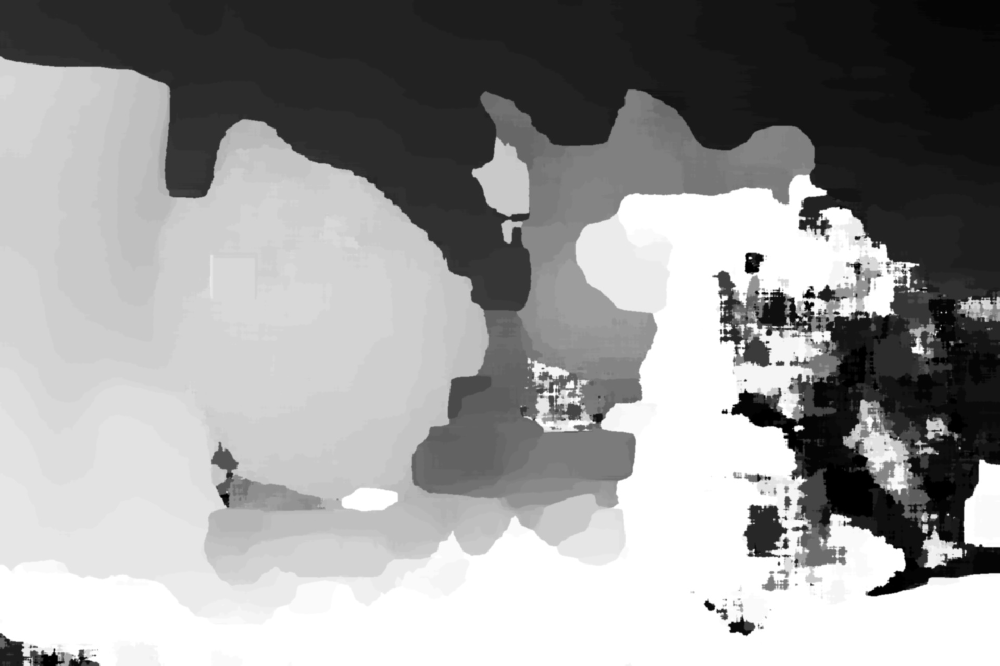
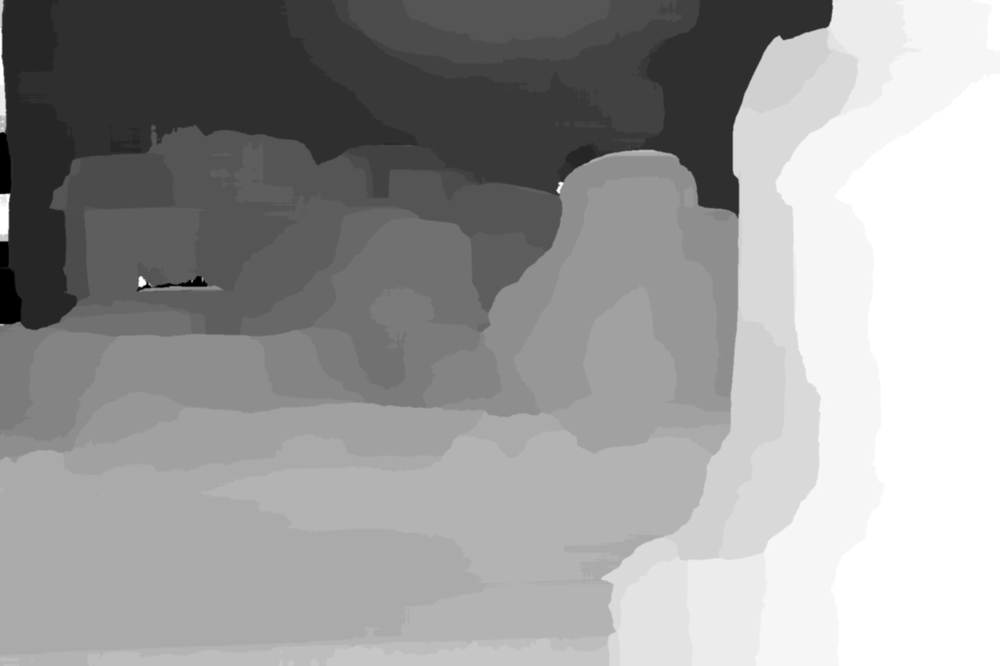
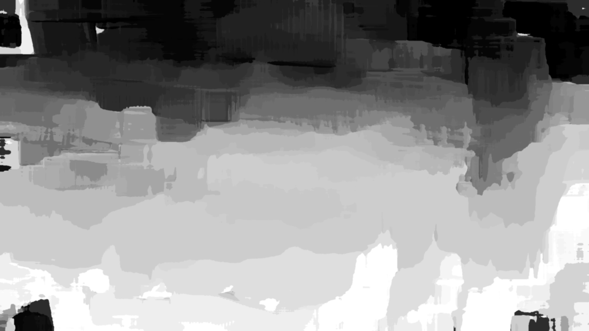
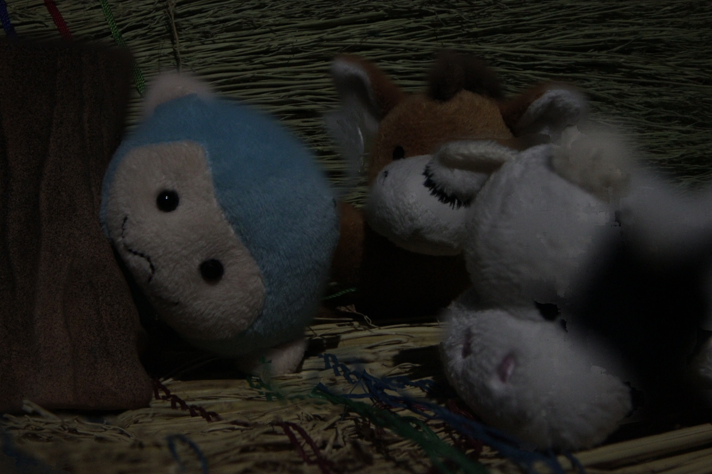
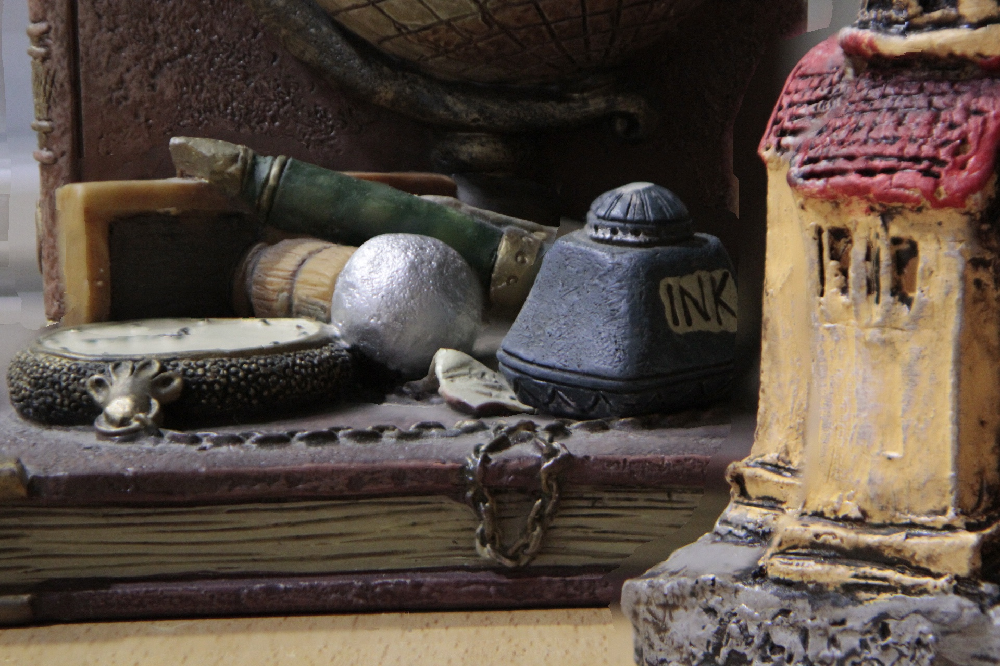
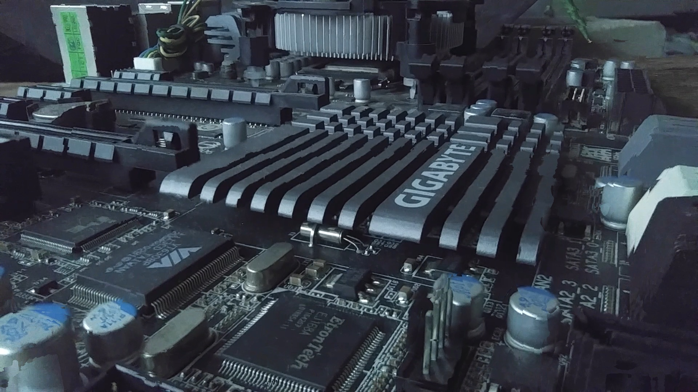

# Depth from Focus
**Depth from focus/defocus** is the problem of estimating the 3D surface of a scene from a set of two or more images of that scene. The images are obtained by changing the camera parameters (typically the focal setting or the image plane axial position), and taken from the same point of view.

## Requirements
To run this code, you need to install a package, [gco_python](https://github.com/amueller/gco_python). It must be installed separately following the instructions on their respective project pages.

## Pipeline
### 1. Image Alignment: Feature based Alignment [1, 2, 3]
1) Convert RGB images A and B to grayscale images A’ and B’
2) Detect **SIFT** features A’ and B’
3) Match features between A’ and B’
4) Compute homography between A’ and B’
5) Align A to B using homography
6) Repeat 1)~5) for all image sequence(focal stack).

---

### 2. Initial depth from focus measure [4, 5, 6, 7]
A Focus Measure operator calculates the best focused point in the image, i.e. a Focus Measure is defined as a quantity for locally evaluating the sharpness of a pixel. When Images are captured with a small depth of field, objects that are away from the camera are out of focus and are perceived as blurry. Thus if we can measure the amount of blur, focus and depth can be measured as well.

1) Convert RGB images A to grayscale image A’
2) To Find where the edge is. first use gaussian blur.
3) Second, use laplacian filter. So called, **LoG(Laplacian of Gaussian)**
4) Then We can obtain a focus map(edge map)
5) Create a new array that each pixel is composed of an index of image with the highest focus value.
6) By normalizing it, we can obtain a depth map.

---

### 3. All-in-focus image [8, 9]
In all-in-focus imaging, a series of photographs taken of the same objects, on different focal planes, are analyzed to create an entirely in-focus final image. 

1) From focus map, we can easily obtain the highest focus value by comparing one another.
2) Picking all the highest focus value from each image, we can combine them into all-in-focus image.

---

### 4. Depth Refinement(Graph-cuts and weighted median filter) [10, 11, 12, 13]
Suppose that each node as pixel and weight of edge as similarity between pixels. Finding the minimum cost to cut is same as finding the most efficient segmentation method.

1) Segment the depth map by using multi-label optimization algorithm, **graph cut**.
2) Refine it with the **weighted median filter**.

---

## Results
### Image Alignment, Feature Matches, Focus Stack
Please refer to the attached file.

---

### Initial Depth map, All-in-Focus image
The further the object is located, the darker its depth map becomes. By and large, below depth map shows pretty reasonable results. But in the first image set, even the right object is the closest object in the image, it is colored as black, because of low illumination condition.

|  |  |  |
|:---:|:---:|:---:|
|  |  |  |
| kernel_size=81 | kernel_size=100 | kernel_size=49 |

---

| No. | References |
|:---:|:---:|
|[1] | https://sites.google.com/site/imagealignment/ |
|[2] | https://www.cs.toronto.edu/~urtasun/courses/CV/lecture06.pdf |
|[3] | https://www.learnopencv.com/image-alignment-feature-based-using-opencv-c-python/ |
|[4] | https://www.cv-foundation.org/openaccess/content_cvpr_2015/papers/Suwajanakorn_Depth_From_Focus_2015_CVPR_paper.pdf |
|[5] | https://www.semanticscholar.org/paper/2-Blur-estimation-using-the-Elder-and-Zucker-method-Zaman/dbf5e58c54fe68591bf749d22b5ac002ca8cfe38 |
|[6] | https://ieeexplore.ieee.org/document/689301 |
|[7] | https://www.sciencedirect.com/science/article/pii/S0031320308000058 |
|[8] | https://ieeexplore.ieee.org/stamp/stamp.jsp?tp=&arnumber=560554 |
|[9] | https://link.springer.com/chapter/10.1007/11559573_22 |
|[10] | https://vision.cs.uwaterloo.ca/code/ |
|[11] | https://peekaboo-vision.blogspot.com/2012/05/graphcuts-for-python-pygco.html |
|[12] | https://github.com/amueller/gco_python |
|[13] | https://github.com/cgearhart/DepthFromDefocus |
